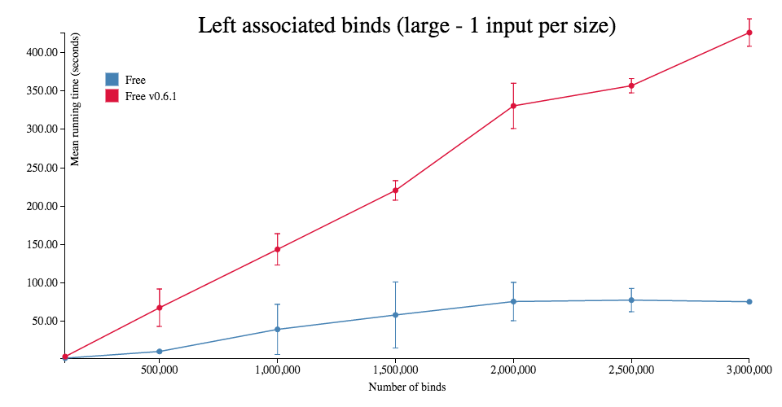
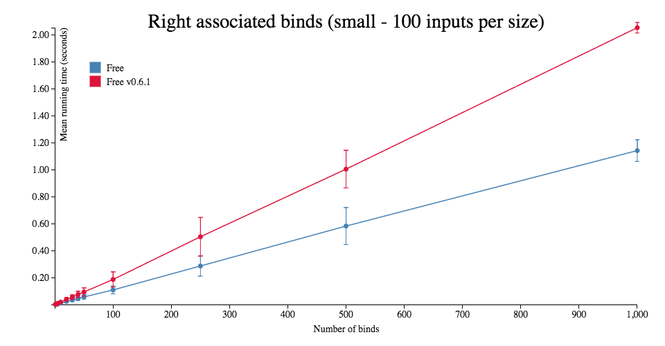
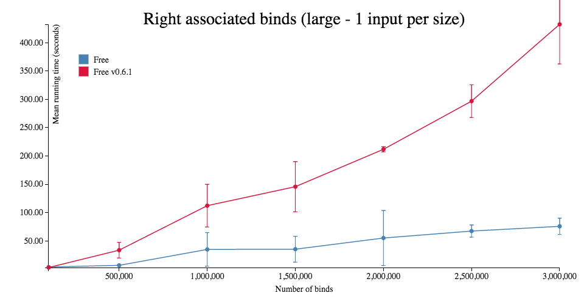

# purescript-free

[](https://github.com/purescript/purescript-free/releases)
[](https://travis-ci.org/purescript/purescript-free)

Free monad, Cofree comonad, Yoneda and Coyoneda functors, and the Trampoline monad implementations for PureScript.

The Free monad implementation is represented using a sequential data structure.

See the following reference for further information.
* [Relection without Remorse](http://okmij.org/ftp/Haskell/zseq.pdf) (Ploeg and Kiselyov 2014)

## Installation

```
bower install purescript-free
```

## Documentation

Module documentation is [published on Pursuit](http://pursuit.purescript.org/packages/purescript-free).

## Benchmarks

The following benchmarks compare the current implementation with the implementation at `v0.6.1` (purescript/purescript-free@0df59c5d459fed983131856886fc3a4b43234f1f), which used the `Gosub` technique to defer monadic binds.







